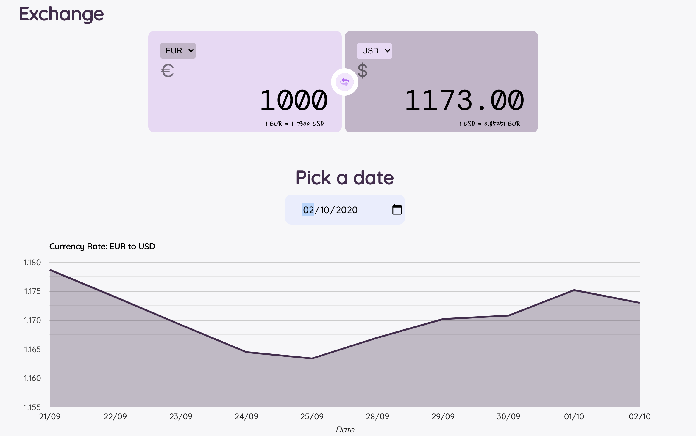

# Exchange Converter 

I have built this exchange converter so I could practice my React skills.

To do so I used the [Exchange Rates API](https://exchangeratesapi.io/) as the source of data for the application.

The chart was built with a hand of [Google Charts for React](https://react-google-charts.com/)

With this application one can convert more than 30 different currencies. 

Furthemore a line chart is shown for the 10 last days indicated by the user for the currency selected.

A deployed version of the application can be found on: www.fabemiliano.github.io/exchange-conveter